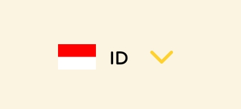
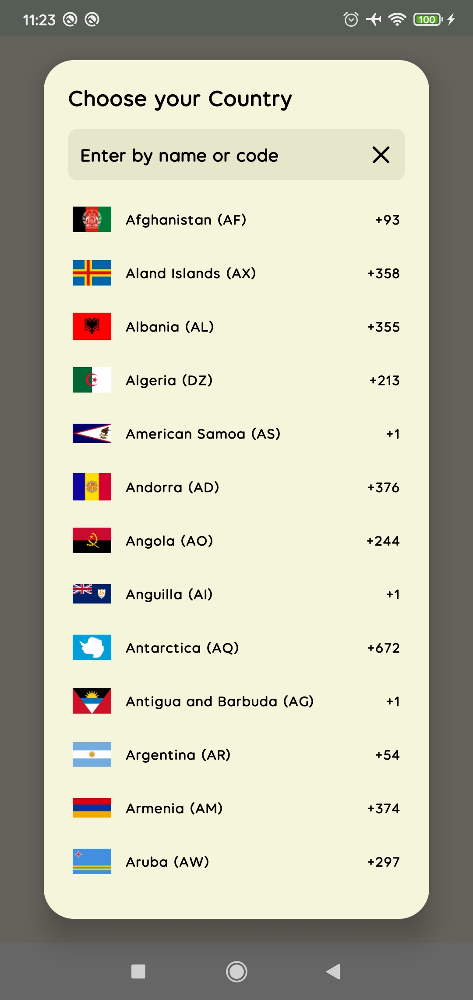
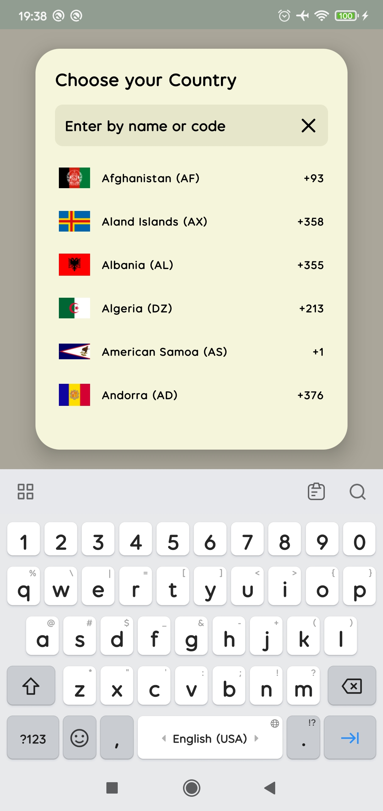
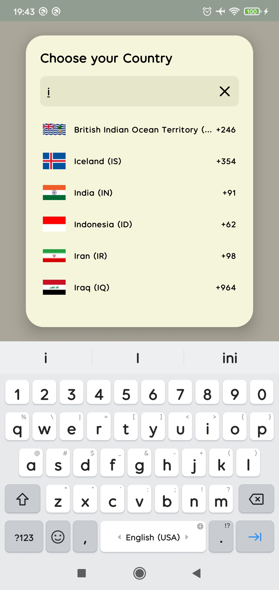
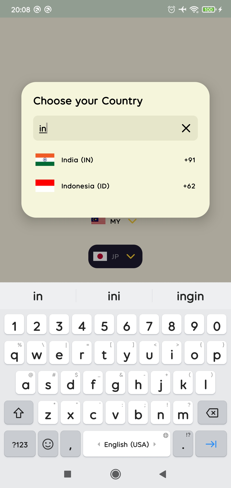
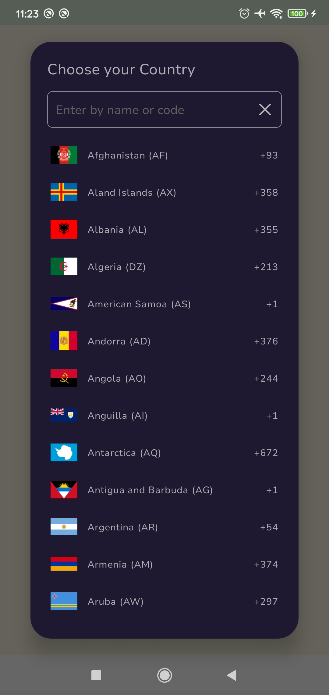
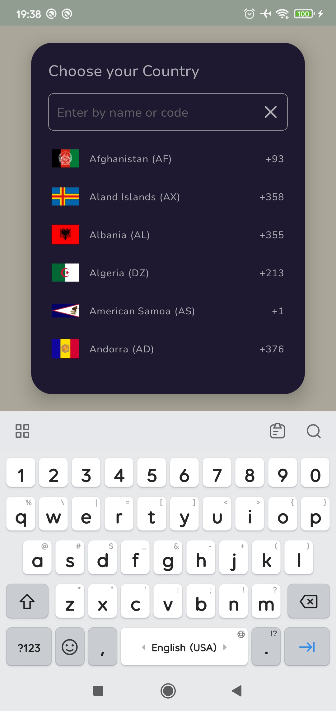
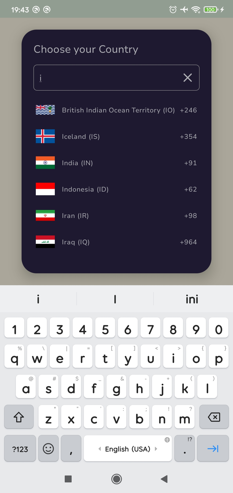
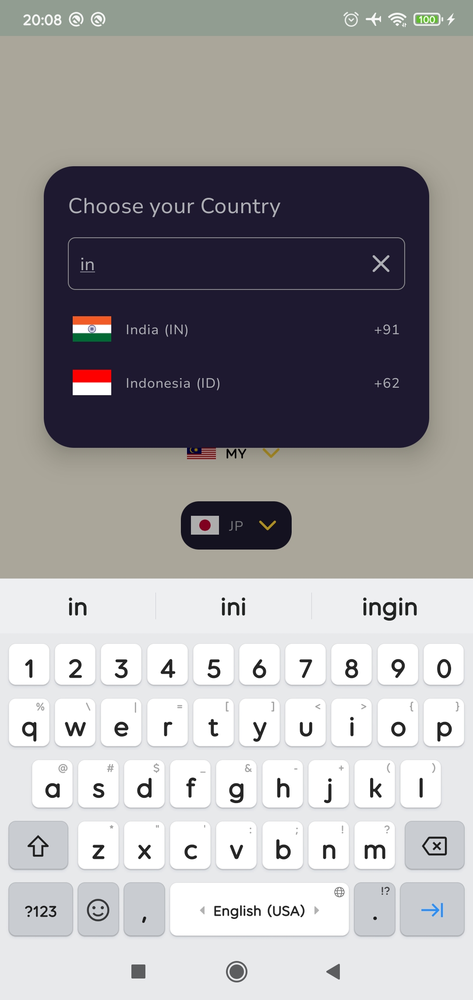

# Country Picker Android


[](https://jitpack.io/#waffiqaziz/country-picker-android)


[](https://visitorbadge.io/status?path=https%3A%2F%2Fgithub.com%2Fwaffiqaziz%2Fcountry-picker-android%2F)


[](https://app.fossa.com/projects/git%2Bgithub.com%2Fwaffiqaziz%2Fcountry-picker-android?ref=badge_small)

A user-friendly country picker for Android that allows users to select countries and search using
country names, country code names, and country phone codes.

## How to Integrate into Your Project

Integrating the `Country Picker Android` library into your Android project is simple and
straightforward.
Follow the steps below based on your Gradle setup.

1. Add JitPack to Your Repositories

   To use the Country Picker Android library, ensure you include the JitPack repository in your
   build.gradle
   files.
   For Gradle Version 7.0 and Above (Using Dependency Resolution Management)
   In your project's settings.gradle (or settings.gradle.kts for Kotlin), add the following:

    ```groovy
    dependencyResolutionManagement {
      repositoriesMode.set(RepositoriesMode.FAIL_ON_PROJECT_REPOS)
      repositories {
        mavenCentral()
        
        // groovy
        maven { url 'https://jitpack.io' }
   
        // kotlin
        maven("https://jitpack.io")
      }
    }
    ```

   For Gradle Version Below 7.0
   In your project-level build.gradle (or build.gradle.kts for Kotlin), add JitPack to the
   repositories
   section:

    ```groovy
    allprojects {
      repositories {
        google()
        mavenCentral()
        
        // groovy
        maven { url 'https://jitpack.io' }
        
        // kotlin
        maven("https://jitpack.io")
      }
    }
    ```

2. Add the Dependency
   Next, add the CountryPicker library dependency in your app-level build.gradle (or
   build.gradle.kts for Kotlin):
   ```groovy
   dependencies {
       // ...others dependency
       
       // groovy
       implementation 'com.github.waffiqaziz:country-picker-android:Tag'                                                                        
   
       // kotlin
       implementation("com.github.waffiqaziz:country-picker-android:Tag")
   }
   ```

   *change `Tag` with the latest version*
3. Sync Your Project

   After adding the dependency, sync your project with Gradle files. You can do this by clicking on
   the "Sync Now" prompt that appears or by going to File > Sync Project with Gradle Files.
4. Usage Example

   The `CountryPicker` library is integrated using XML layouts.

    <details>
      <summary>Basic implementation</summary>

      ```xml
      <com.waffiq.CountryPickerButton
        android:id="@+id/cpb"
        android:layout_width="wrap_content"
        android:layout_height="wrap_content"
        android:layout_gravity="center"
        android:clickable="true"
        android:focusable="true"
        android:foreground="?attr/selectableItemBackgroundBorderless"
        app:cardBackgroundColor="@android:color/transparent"
        app:cardCornerRadius="15dp"
        app:cardElevation="0dp"
        app:strokeWidth="0dp" />
      ```

   |                 CountryPickerButton                  |                                                                                                  CountryPickerDialog                                                                                                   |
   |:----------------------------------------------------:|:----------------------------------------------------------------------------------------------------------------------------------------------------------------------------------------------------------------------:|
   |  |      |
    
   </details>

   <details>
      <summary>With customization</summary>

      ```xml
      <com.waffiq.CountryPickerButton
        android:id="@+id/cpb_custom"
        android:layout_width="wrap_content"
        android:layout_height="wrap_content"
        android:layout_gravity="center"
        android:clickable="true"
        android:focusable="true"
        android:foreground="?attr/selectableItemBackgroundBorderless"
        app:cardBackgroundColor="@color/darkPurple"
        app:cardCornerRadius="15dp"
        app:cardElevation="0dp"
        app:cpa_defaultCountryISO="US"
        app:cpa_dialogApplyBorderSearch="true"
        app:cpa_dialogAutoFocus="true"
        app:cpa_dialogBackgroundColor="@color/darkPurple"
        app:cpa_dialogSearchBackgroundColor="@color/darkPurple"
        app:cpa_dialogSearchCrossIconColor="@color/gray"
        app:cpa_dialogTextColor="@color/gray"
        app:cpa_dialogTextHintColor="@color/dark_gray"
        app:cpa_fontFamily="@font/nunito_sans_regular"
        app:strokeWidth="0dp" />
   ```

   |                  CountryPickerButton                  |                                                                                                    CountryPickerDialog                                                                                                    |
   |:-----------------------------------------------------:|:-------------------------------------------------------------------------------------------------------------------------------------------------------------------------------------------------------------------------:|
   |  |     |
   
   </details>

## Listeners and functions

### Set default country

To set the default country programmatically, you can use the `setCountry()` method:

  ```kotlin
  binding.cpb.setCountry("MY")  // use viewbinding

  // or

  findViewById<CountryPickerButton>(R.id.cpb).setCountry("MY")
  ```

### Get selected country

To get the selected country when using `CountryPickerButton`, you can implement
the `onCountrySelectedListener`:

   ```kotlin
   binding.cpb.onCountrySelectedListener = {
      Toast.makeText(this@MainActivity, it.name, Toast.LENGTH_SHORT).show()
   }
   ```

To get the selected country without listener using `selectedCountryCode`

   ```kotlin
   binding.cpb.selectedCountryCode // return "ID" (default country)
   ```

Note : You can also explore more about `CountryPickerButton`
via [activity_layout](https://github.com/waffiqaziz/country-picker-android/blob/master/app/src/main/res/layout/activity_main.xml). `CountryPickerButton`
basically implemented as an extension of `MaterialCardView`, giving you more flexibility to
customize its appearance and behavior according to the Material Design guidelines. You can read more
about
MaterialCardView [here](https://github.com/material-components/material-components-android/blob/master/docs/components/Card.md).

## How to Contribute

Read this [page](CONTRIBUTE.md)

## License

[Apache Version 2.0](LICENSE)

```text
Copyright 2024 Waffiq Aziz

Licensed under the Apache License, Version 2.0 (the "License");
you may not use this file except in compliance with the License.
You may obtain a copy of the License at

    http://www.apache.org/licenses/LICENSE-2.0

Unless required by applicable law or agreed to in writing, software
distributed under the License is distributed on an "AS IS" BASIS,
WITHOUT WARRANTIES OR CONDITIONS OF ANY KIND, either express or implied.
See the License for the specific language governing permissions and
limitations under the License.
```

## Reporting Issues

If you encounter any issues or bugs, feel free to open a new issue in the repository and provide as
much detail as possible. Include `steps to reproduce the issue`, the `expected behavior`, and any
`relevant logs`.

## Special Thanks

Grateful acknowledgment to the following resources and projects for their valuable contributions:


- [Flagpedia.net](https://flagpedia.net/download) - For providing the country flags used in this
  project.
- [CountryCodePickerProject](https://github.com/hbb20/CountryCodePickerProject) - For inspiring the
  creation of this project.
